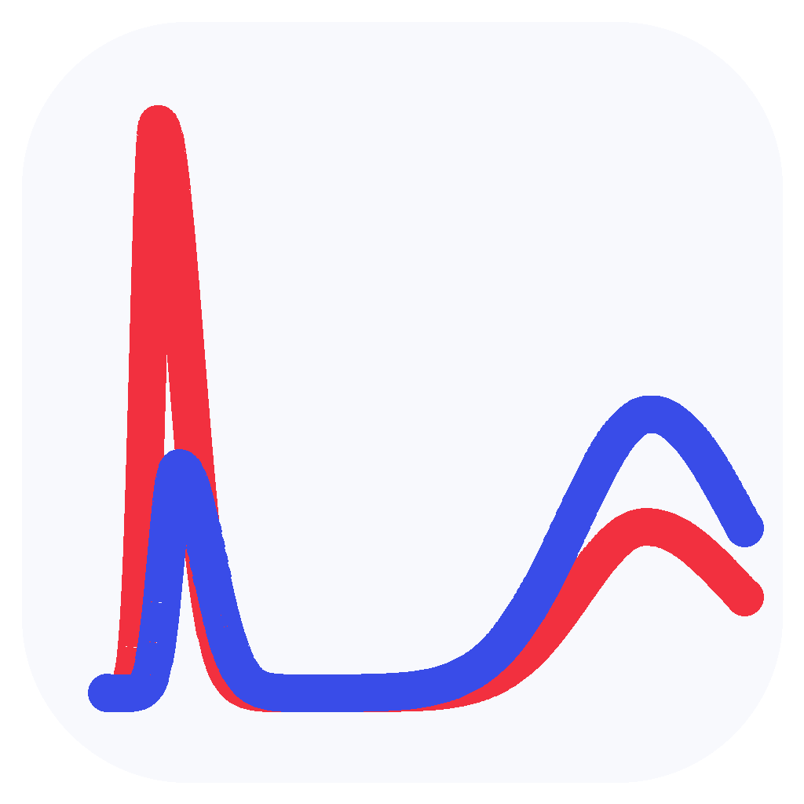

<h1 align="center">MDHelper</h1>

<p align="center">
  
</p>

[English](README.md) | [简体中文](README.zh-CN.md)

> **面向分子动力学 (MD) 模拟的本地数据后处理与可视化工具**

MDHelper 是一款为分子动力学模拟设计的本地数据后处理应用。它旨在简化繁琐的分析流程，整合多种工具链，并提供快速、可复现的数据分析、绘图与导出功能。

> [!NOTE]
> MDHelper 目前处于快速开发阶段。

---

## 主要特性

- **两条分析流水线**
  - **MDAnalysis**：集成 MDAnalysis 生态，支持主流轨迹格式的读取与处理。
  - **GROMACS**：直接调用本机 `gmx` 或 `gmx_mpi` 可执行文件，完成原生输入解析与分析。
- **周期性边界处理**：完整支持正交 (Orthogonal) 与三斜 (Triclinic) 周期性边界条件 (PBC)。
- **工作流设计 (Workflow)**：可在配置文件中配置可复用的工作流，实现批处理与自动化分析。
- **一键多格式导出**：一键生成完整分析 JSON、结构化 CSV 数据，以及适用于学术发表的 PNG、SVG、PDF 矢量/位图图表。
- **生态集成 (Integrations)**：程序可通过调用本地已有分子模拟软件完成任务。

---

## 快速上手

| 模式 | 执行命令 | 核心用途 | 适用平台 |
| :--- | :--- | :--- | :--- |
| **GUI** | `mdhelper` 或 `mdhelper gui` | 可视化项目管理、交互分析与实时绘图 | Windows / Linux |
| **TUI** | `mdhelper tui` | 终端引导式交互，适用于无图形界面的服务器环境 | Windows / Linux |
| **CLI** | `mdhelper <command>` 或 `mdhelper cli <command>` | 命令行自动化脚本与批量任务处理 | Windows / Linux |

### 运行与启动

- **界面自动回退**：直接运行 `mdhelper` 时，系统将优先检测 Qt 及显示环境以启动 GUI 模式；若环境不可用，则平滑回退至 TUI 模式。
- **开箱即用**：Linux 与 Windows 的发布包包含单一可执行程序及同目录的 `config.toml` 配置文件，无需管理员权限。
- **源码开发要求**：从源码构建需要 Python 3.12+ 及包管理器 [`uv`](https://docs.astral.sh/uv/)。

详细操作请参阅 [使用说明](docs/USAGE.zh-CN.md) 与 [打包与发布验证](docs/PACKAGING.zh-CN.md)。

---

## 项目管理与数据导出

在指定工作目录下运行分析时，MDHelper 会自动创建项目配置文件 `mdhelper-project.json` 及对应的数据管理目录：

```text
working-directory/
├── mdhelper-project.json   # 项目状态与配置信息
├── results/                # 结构化数据文件 (JSON/CSV)
├── figures/                # 自动生成图表 (PNG/SVG/PDF)
└── cache/                  # 分析缓存
```

## 工作流设计 (Workflow)

Workflow 以命名、有序的分析类型序列保存在 `config.toml` 中。序列内的项目各自保留其参数和绘图设置；用户确认配置后，MDHelper 按顺序将它们提交到标准分析队列，适合
重复分析与批处理。

详细配置与操作请参阅 [配置说明](docs/CONFIGURATION.zh-CN.md#workflow) 和
[使用说明](docs/USAGE.zh-CN.md#gui-workflow)。

## 生态集成 (Integrations)

MDHelper 能够自动识别并集成系统环境中安装的第三方分子模拟工具，目前已支持：

- **GROMACS**
- **VMD**

详细配置流程请参阅 [配置说明](docs/CONFIGURATION.zh-CN.md)。

## 文档指南

> 项目文档由 gpt-5.6-sol 辅助生成并持续维护优化中。

- [使用说明](docs/USAGE.zh-CN.md)
- [配置说明](docs/CONFIGURATION.zh-CN.md)
- [选择规则](docs/SELECTIONS.zh-CN.md)
- [已知限制](docs/KNOWN_LIMITATIONS.zh-CN.md)
- [软件设计目标](docs/SOFTWARE_DESIGN_GOALS.zh-CN.md)
- [软件架构](docs/ARCHITECTURE.zh-CN.md)
- [算法说明](docs/ALGORITHM.zh-CN.md)
- [物种角色](docs/SPECIES.zh-CN.md)
- [打包说明](docs/PACKAGING.zh-CN.md)

## 许可证

MDHelper 遵循 GNU General Public License version 2 协议开源。
