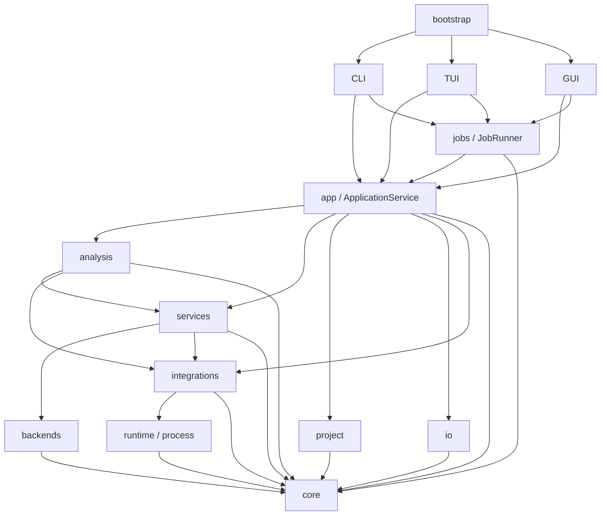

# MDHelper 0.1.0 architecture

[English](ARCHITECTURE.md) | [Simplified Chinese](ARCHITECTURE.zh-CN.md)

This document describes the current code structure, dependency boundaries, and runtime data flow.
Algorithm definitions live in [ALGORITHM.md](ALGORITHM.md), while user workflows and release
details live in the other documents linked at the end.

## 1. System boundary

MDHelper is a local Python 3.12 application for molecular-dynamics analysis. It exposes the same
application capabilities through CLI, TUI, and Qt GUI adapters. The current release supports RDF,
Cumulative Number RDF, and EDR energy extraction.

Each analysis runs through one complete backend:

| Backend | RDF | Cumulative RDF | Energy | Execution model |
| --- | --- | --- | --- | --- |
| MDAnalysis | yes | yes | yes | In-process library adapters and numerical analysis |
| GROMACS | yes | yes | yes | Local GROMACS commands through the integration boundary |

GROMACS is optional. A backend attempt owns input loading, selection semantics, frame handling,
and analysis execution as one unit. Components from different backends are never combined in one
attempt.

## 2. Dependency structure

An arrow points from a package to its dependency. The diagram shows the primary request and
execution dependencies rather than every utility import:



The enforced boundaries are:

- `core` has no dependency on another MDHelper package.
- `cli`, `tui`, and `gui` do not import each other or import `analysis` and `backends` directly.
- `bootstrap` is the only package that composes presentation adapters.
- Qt imports remain inside `gui`, and GUI state modules remain independent of Qt.
- `analysis` and `backends` do not execute subprocesses or import `runtime` directly.
- Analysis computation does not depend on plotting.
- Focused subpackages use an explicit inward module order without circular dependencies.

`tests/test_architecture.py` checks these dependency boundaries.

## 3. Package responsibilities

| Package | Responsibility |
| --- | --- |
| `bootstrap` | Public entry-point dispatch and portable configuration activation |
| `cli`, `tui`, `gui` | Input collection, presentation state, and result rendering |
| `app` | `ApplicationService`, feature orchestration, export plans, and readable reports |
| `jobs` | Synchronous and threaded execution, progress, status, and cancellation |
| `core` | Requests, results, domain records, protocols, errors, units, and plot models |
| `analysis` | Complete `mdanalysis/` and `gromacs/` pipelines plus shared pipeline contracts and radial diagnostics |
| `backends` | Matching `mdanalysis/` and `gromacs/` input adapters that produce core objects |
| `services` | Configuration, system inspection, selection, provenance, run streams, and templates |
| `integrations` | External-tool adapters, capability status, and execution coordination |
| `runtime` | Process lifecycle, detection primitives, environment filtering, and logging |
| `project` | Manifest, input identity, result repository, run archive, and atomic storage |
| `io` | NDX parsing plus structured-data and figure export adapters |
| `resources` | Packaged read-only templates |
| `workflow` | Reserved package for future user-authored orchestration; currently empty |

The `mdhelper` package root contains only public entry points and version metadata. Larger features
reside in focused packages and subpackages.

## 4. Startup and composition

`bootstrap/portable.py` owns the `mdhelper` entry point. An argument-free invocation starts the GUI
when Qt and a display are available and otherwise starts the TUI. Explicit `gui`, `tui`, and `cli`
modes select one adapter, while other arguments are handled by the CLI. Frozen distributions use a
colocated `config.toml` unless `MDHELPER_CONFIG` already selects another file.

`app/facade.py` is the application composition root. `ApplicationService` constructs the shared
configuration, integration manager, analysis registry, and trajectory loader, then exposes grouped
features for inspection, analysis, export, projects, integrations, and templates. Concrete feature
groups live under `app/features/`, while readable result renderers live under `app/reports/`.
Registries and loaders are injectable, so tests exercise this boundary without a GUI or external
executable.

Presentation packages build core requests and call application features. Shared support packages
provide job execution, project session state, and integration status, while numerical engines stay
behind the application boundary.

## 5. Analysis flow

An analysis follows one stable sequence:

```text
AnalysisRequest
  -> request validation
  -> complete backend resolution
  -> input loading and static selection, when required
  -> provenance collection
  -> backend execution
  -> AnalysisResult validation
  -> optional export or project commit
```

`analysis/pipeline/` defines `BackendAdapter`, `BackendQuery`, `AnalysisInput`, and
`AnalysisRegistry`. The registry contains one entry for each complete backend, not one entry for
each backend-analysis pair. A backend declares its supported analysis types, automatic priority,
required external capabilities, input-loading behavior, and execution method.

Backend-specific analysis code is contained in `analysis/mdanalysis/` and `analysis/gromacs/`.
Their input and selection adapters follow the same split under `backends/`; shared dispatch and
backend-neutral radial diagnostics remain outside those two pipeline packages.

Automatic resolution orders eligible complete backends by priority. MDAnalysis is the general
in-process candidate, and GROMACS is eligible when its required capabilities are available.
Fallback occurs only between complete attempts. Explicit backend selection resolves one backend
and reports its failure directly.

The MDAnalysis radial path converts inputs to the narrow `TrajectorySource` protocol. The GROMACS
path invokes local commands directly through
`integrations` and retains command records in provenance. External library objects and subprocess
objects do not cross their adapter boundaries.

## 6. Data contracts

`core/analysis/` defines strict schema-version-1 request and result records. RDF and cumulative RDF
use `RadialRequest`; energy extraction uses `EnergyRequest`. Every `AnalysisResult` contains its
complete request, data, parameters, units, diagnostics, provenance, warnings, identity, method
version, and creation time. Unknown fields, missing fields, invalid enums, and inconsistent arrays
fail validation. Version 0.1.0 contains no compatibility or migration path for persisted schemas.

Trajectory and selection adapters expose stable zero-based atom indices and frame ranges. Radial
calculation uses nanometres internally. Selection membership remains fixed during an analysis.
Species roles record descriptive provenance and do not select atoms or alter numerical parameters.

Plot contracts live under `core/plotting/`, separate from numerical analysis. The same plot models
and persisted plot state drive GUI display and figure export.

## 7. Persistence and export

A project is rooted by `mdhelper-project.json` and uses this layout:

```text
project/
|-- mdhelper-project.json
|-- results/
|   |-- data/
|   `-- runs/
|-- figures/
`-- cache/
```

The manifest stores schema and application versions, content-addressed input records, species
roles, committed result indexes, and plot state. Complete result JSON files remain the source of
analysis parameters, data, diagnostics, and provenance. Result and input fingerprints detect
unexpected changes, and derived paths are constrained to the project root.

Manifest and result updates use atomic replacement. Integration output bodies live in separate
fingerprinted stream files instead of the manifest. Project relocation accepts a replacement input
only when its content hash matches. `cache` contains rebuildable trajectory indexes and external
tool work files; deleting it does not remove canonical results.

`io/export/` writes validated JSON and CSV data and renders PNG, SVG, and PDF figures. Export is a
separate application use case, so successful analysis does not imply disk output. Project commits
and standalone exports share the same validated result contract.

## 8. Jobs and external processes

`jobs` owns pending, running, completed, failed, and cancelled state. `JobRunner` calls the same
analysis use case for synchronous and threaded execution. Cancellation is cooperative across frame
processing, input hashing, and external-process polling. GUI workers report state back to the Qt
thread and do not mutate widgets directly.

`integrations` owns external-tool identity, configuration, capability detection, and command
coordination. `runtime/process/` owns the actual process lifecycle. Commands use argument vectors,
filtered environments, captured streams, timeouts, and process-group termination. Each execution
produces an auditable run record with executable identity, arguments, timing, outcome, and stream
fingerprints.

## 9. Change impact

A new analysis type changes the core request/result contract, JSON schemas, method definition,
supporting complete backend adapters, application features, exports, presentation adapters, and
their tests. A new backend implements one complete `BackendAdapter` and adds one registry entry. A
new external tool adds an integration adapter while process management remains in `runtime`. A new
presentation adapter consumes application features and `core` without importing analysis
engines.

The test suite covers contracts, numerical behavior, application orchestration, persistence,
exports, presentations, package boundaries, and platform-specific startup. Ruff, mypy, the full
Linux suite, and the full Windows suite are the repository completion gates.

## 10. Related documents

- [Usage](USAGE.md) describes user-facing workflows and commands.
- [Configuration](CONFIGURATION.md) describes configuration fields and path resolution.
- [Selections](SELECTIONS.md) describes selection syntax and backend semantics.
- [Algorithm](ALGORITHM.md) defines numerical and deterministic engineering behavior.
- [Methods](methods/README.md) defines released scientific methods.
- [Validation](validation/) contains reference evidence and tolerances.
- [Known limitations](KNOWN_LIMITATIONS.md) records current product limits.
- [Software design goals](SOFTWARE_DESIGN_GOALS.md) records engineering properties and acceptance.
- [Packaging](PACKAGING.md) describes platform artifacts and release validation.
