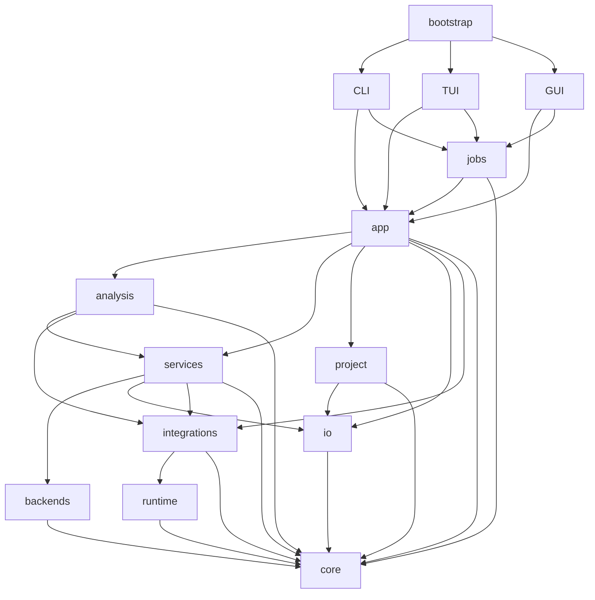

# MDHelper architecture

[English](ARCHITECTURE.md) | [Simplified Chinese](ARCHITECTURE.zh-CN.md)

This document defines package ownership, dependency rules, and runtime flow for MDHelper.

## Scope

MDHelper is a local Python 3.12 application with CLI, TUI, and Qt GUI adapters. It supports RDF,
Cumulative Number RDF, and EDR energy extraction through two complete backends:

| Backend | RDF | Cumulative RDF | Energy | Execution |
| --- | --- | --- | --- | --- |
| MDAnalysis | yes | yes | yes | In-process |
| GROMACS | yes | yes | yes | Local commands |

One analysis attempt uses one backend for input loading, selection, frame handling, and
calculation. GROMACS is optional.

## Dependencies

Arrows point to dependencies:



The repository enforces these rules:

- `core` has no dependency on another MDHelper package.
- `cli`, `tui`, and `gui` do not import each other, `analysis`, or `backends`.
- `bootstrap` composes presentation adapters.
- Qt imports stay in `gui`; GUI state modules do not require Qt.
- `analysis` and `backends` do not execute processes or import `runtime`.
- Analysis code does not depend on plotting.
- `io` and `project` do not depend on application orchestration.
- Top-level and subpackage imports remain acyclic.

`tests/test_architecture.py` checks these rules.

## Package ownership

| Package | Owns |
| --- | --- |
| `bootstrap` | Entry-point dispatch and portable configuration activation |
| `cli`, `tui`, `gui` | Input, presentation state, and rendering |
| `app` | Use-case orchestration, export plans, and reports |
| `jobs` | Execution state, progress, and cancellation |
| `core` | Domain records, contracts, protocols, errors, units, and plot models |
| `analysis` | Backend pipelines and radial diagnostics |
| `backends` | Input and selection adapters |
| `services` | Configuration, inspection, selection, provenance, and templates |
| `integrations` | External-tool adapters, detection, and command coordination |
| `runtime` | Process lifecycle, environment filtering, and logging |
| `project` | Manifest, input identity, result repository, and atomic storage |
| `io` | Fingerprints, stream storage, NDX parsing, and export adapters |
| `resources` | Packaged templates |

The package root contains entry points and version metadata only.

## Composition and flow

`bootstrap/portable.py` selects GUI, TUI, or CLI. With no mode, it starts GUI when Qt and a display
are available, then falls back to TUI. Frozen builds use the colocated `config.toml` unless
`MDHELPER_CONFIG` is set.

`app/facade.py` constructs configuration, integrations, the analysis registry, and input loaders.
Presentation adapters build core requests and call its feature groups. Registries and loaders are
injectable.

```text
AnalysisRequest
  -> validation
  -> complete backend resolution
  -> input loading and static selection
  -> provenance collection
  -> backend execution
  -> AnalysisResult validation
  -> optional export or project commit
```

`analysis/pipeline/` defines the backend contract and registry. Each registry entry represents a
complete backend and declares supported analyses, priority, capabilities, loading, and execution.
Automatic fallback occurs between complete attempts. Explicit backend selection does not fall
back.

MDAnalysis objects stay inside its adapters. GROMACS commands pass through `integrations` and
`runtime`; process objects do not cross that boundary.

## Contracts

`core/analysis/` defines schema-version-1 requests and results. RDF and cumulative RDF use
`RadialRequest`; energy uses `EnergyRequest`. Results contain the request, data, parameters, units,
diagnostics, provenance, warnings, identity, method version, and creation time. Parsers reject
unknown, missing, or inconsistent fields.

Adapters expose zero-based atom indices and frame ranges. Radial calculations store nm. Atom
membership remains fixed during a run. Project `.itp` files provide advisory species-role evidence;
suggestions remain session-only, while confirmed roles are stored in requests and project manifests.
Roles do not change selections or parameters.

Plot contracts live in `core/plotting/`. GUI preview and figure export consume the same plot model
and state.

## Persistence and processes

```text
project/
|-- mdhelper-project.json
|-- results/
|   |-- data/
|   `-- runs/
|-- figures/
`-- cache/
```

The manifest stores versions, input identities, confirmed species roles, result indexes, and plot
state.
Full result JSON files own analysis data and provenance. SHA-256 identifies inputs, results, and
integration streams. Derived paths must remain under the project root. Manifest and result writes
use atomic replacement. `cache` contains rebuildable data only.

`jobs` owns pending, running, completed, failed, and cancelled states. Cancellation is cooperative
at frame processing, file hashing, and process polling. GUI workers report state to the Qt thread.

`runtime/process/` runs argument vectors with filtered environments, captured streams, timeouts,
and process-group termination. Each run records executable identity, arguments, timing, outcome,
and stream fingerprints.

## Related documents

- [Usage](USAGE.md) lists commands and workflows.
- [Configuration](CONFIGURATION.md) defines settings.
- [Selections](SELECTIONS.md) defines selection input and species roles.
- [Algorithm](ALGORITHM.md) defines implemented behavior.
- [Methods](methods/README.md) defines versioned calculations.
- [Validation](validation/) records checks and limits.
- [Packaging](PACKAGING.md) defines release artifacts.
