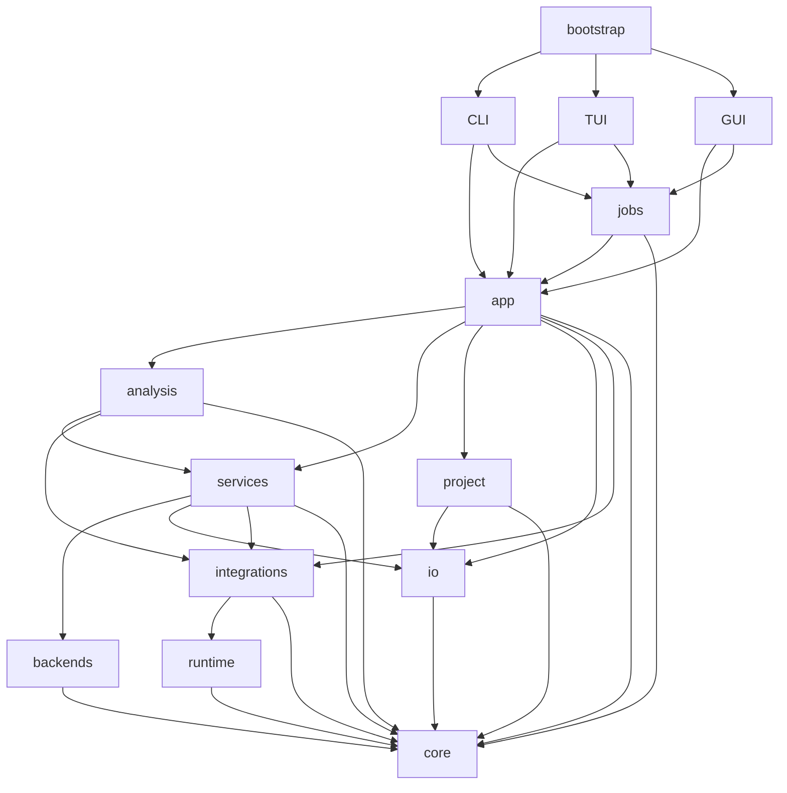

# MDHelper 软件架构

[English](ARCHITECTURE.md) | [简体中文](ARCHITECTURE.zh-CN.md)

本文定义 MDHelper 0.1.0 的包职责、依赖规则和运行流程。

## 范围

MDHelper 是本地 Python 3.12 应用，提供 CLI、TUI 和 Qt GUI。当前支持 RDF、Cumulative
Number RDF 和 EDR energy 提取，并提供两个完整 Backend：

| Backend | RDF | 累积 RDF | Energy | 执行方式 |
| --- | --- | --- | --- | --- |
| MDAnalysis | 支持 | 支持 | 支持 | 进程内 |
| GROMACS | 支持 | 支持 | 支持 | 本地命令 |

一次分析尝试只使用一个 Backend 完成输入加载、选择、帧处理和计算。GROMACS 是可选依赖。

## 依赖

箭头指向被依赖包：



代码遵守以下规则：

- `core` 不依赖其他 MDHelper 包。
- `cli`、`tui`、`gui` 不互相导入，也不导入 `analysis` 或 `backends`。
- `bootstrap` 负责装配表现层。
- Qt 导入只存在于 `gui`；GUI 状态模块不依赖 Qt。
- `analysis` 和 `backends` 不执行进程，也不导入 `runtime`。
- 分析代码不依赖绘图。
- `io` 和 `project` 不依赖应用编排。
- 顶层包和子包不形成循环依赖。

`tests/test_architecture.py` 检查这些规则。

## 包职责

| 包 | 职责 |
| --- | --- |
| `bootstrap` | 入口分派和便携配置激活 |
| `cli`、`tui`、`gui` | 输入、表现层状态和渲染 |
| `app` | 用例编排、导出计划和报告 |
| `jobs` | 执行状态、进度和取消 |
| `core` | 领域记录、契约、协议、错误、单位和绘图模型 |
| `analysis` | Backend 管线和径向诊断 |
| `backends` | 输入和选择适配器 |
| `services` | 配置、检查、选择、provenance 和模板 |
| `integrations` | 外部工具适配、检测和命令协调 |
| `runtime` | 进程生命周期、环境过滤和日志 |
| `project` | Manifest、输入身份、结果仓库和原子存储 |
| `io` | 指纹、流存储、NDX 解析和导出适配器 |
| `resources` | 随包模板 |

包根目录只包含入口和版本元数据。

## 装配与流程

`bootstrap/portable.py` 选择 GUI、TUI 或 CLI。无显式模式时，有 Qt 和 display 即启动 GUI，
否则启动 TUI。冻结程序使用同目录 `config.toml`，除非设置了 `MDHELPER_CONFIG`。

`app/facade.py` 构造配置、Integration、分析注册表和输入加载器。表现层构造 Core request，
再调用功能组。注册表和加载器支持注入。

```text
AnalysisRequest
  -> validation
  -> complete backend resolution
  -> input loading and static selection
  -> provenance collection
  -> backend execution
  -> AnalysisResult validation
  -> optional export or project commit
```

`analysis/pipeline/` 定义 Backend 契约和注册表。每个条目代表一个完整 Backend，并声明支持的
分析、优先级、能力、加载和执行方式。Auto 只在完整尝试之间回退；显式 Backend 不回退。

MDAnalysis 对象不离开对应适配器。GROMACS 命令经过 `integrations` 和 `runtime`；进程对象
不越过该边界。

## 契约

`core/analysis/` 定义 schema version 1 的 request 和 result。RDF 与累积 RDF 使用
`RadialRequest`，energy 使用 `EnergyRequest`。Result 包含 request、数据、参数、单位、诊断、
provenance、警告、身份、方法版本和创建时间。解析器拒绝未知、缺失或不一致的字段。0.1.0
不提供 schema 迁移。

适配器输出零基原子索引和帧范围。径向计算存储 nm。分析期间原子成员不变。Project `.itp`
文件提供物种角色参考证据；建议只存在于当前 session，确认后的角色存入 request 和 project
manifest。角色不修改选择或参数。

绘图契约位于 `core/plotting/`。GUI 预览和图片导出使用同一绘图模型和状态。

## 持久化与进程

```text
project/
|-- mdhelper-project.json
|-- results/
|   |-- data/
|   `-- runs/
|-- figures/
`-- cache/
```

Manifest 保存版本、输入身份、确认后的物种角色、结果索引和绘图状态。完整 result JSON 保存
分析数据和 provenance。输入、结果和 Integration stream 使用 SHA-256 标识。派生路径必须位于
项目根目录。Manifest 和 result 使用原子替换。`cache` 只保存可重建数据。

`jobs` 管理 pending、running、completed、failed 和 cancelled 状态。帧处理、文件 hash 和
进程轮询支持协作取消。GUI worker 把状态交回 Qt 线程。

`runtime/process/` 使用参数向量、受限环境、输出捕获、超时和进程组终止。Run record 保存
可执行文件身份、参数、时间、结果和 stream 指纹。

## 相关文档

- [使用说明](USAGE.zh-CN.md) 列出命令和流程。
- [配置](CONFIGURATION.zh-CN.md) 定义设置。
- [选择](SELECTIONS.zh-CN.md) 定义选择输入。
- [算法](ALGORITHM.zh-CN.md) 定义实现行为。
- [方法](methods/README.zh-CN.md) 定义已发布计算。
- [验证](validation/) 记录检查和限制。
- [已知限制](KNOWN_LIMITATIONS.zh-CN.md) 记录未支持行为。
- [设计目标](SOFTWARE_DESIGN_GOALS.zh-CN.md) 定义工程约束。
- [打包](PACKAGING.zh-CN.md) 定义发布产物。
