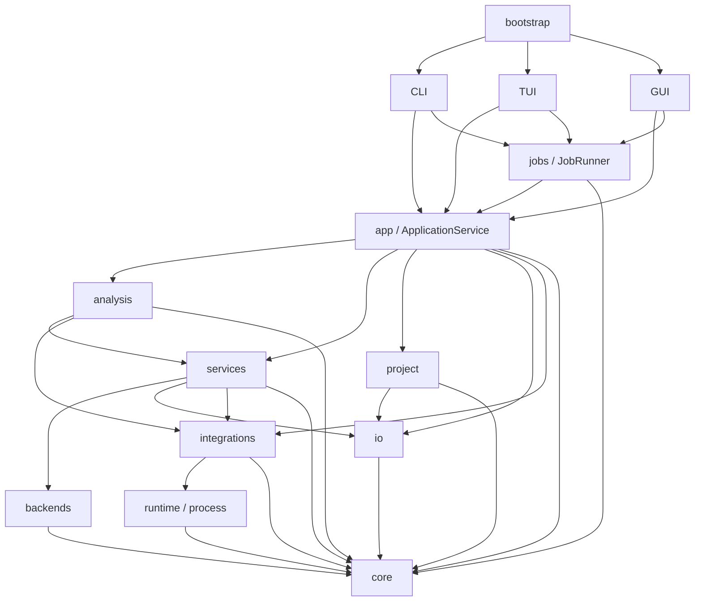

# MDHelper 0.1.0 软件架构

[English](ARCHITECTURE.md) | [简体中文](ARCHITECTURE.zh-CN.md)

本文描述当前代码结构、依赖边界和运行时数据流。算法定义位于
[ALGORITHM.md](ALGORITHM.zh-CN.md)，用户流程和发布细节位于文末列出的其他文档。

## 1. 系统边界

MDHelper 是一个面向分子动力学分析的本地 Python 3.12 应用。CLI、TUI 和 Qt GUI 通过
不同表现层适配器提供相同的应用能力。当前版本支持 RDF、Cumulative Number RDF 和 EDR
energy 提取。

每次分析使用一个完整 Backend：

| Backend | RDF | 累积 RDF | Energy | 执行方式 |
| --- | --- | --- | --- | --- |
| MDAnalysis | 支持 | 支持 | 支持 | 进程内库适配和数值分析 |
| GROMACS | 支持 | 支持 | 支持 | 通过 Integration 边界调用本地 GROMACS 命令 |

GROMACS 是可选依赖。一次 Backend 尝试完整负责输入加载、选择语义、帧处理和分析执行，
不同 Backend 的组件不会在同一次尝试中混用。

## 2. 依赖结构

箭头从依赖方指向被依赖方。该图表示主要请求与执行依赖，不包含每个工具模块的导入关系：



代码执行以下边界约束：

- `core` 不依赖其他 MDHelper 包。
- `cli`、`tui` 和 `gui` 不互相导入，也不直接导入 `analysis` 和 `backends`。
- `bootstrap` 是唯一组合表现层适配器的包。
- Qt 导入只存在于 `gui`，GUI 状态模块不依赖 Qt。
- `analysis` 和 `backends` 不直接执行子进程，也不直接导入 `runtime`。
- 分析计算不依赖绘图。
- `io` 和 `project` 不依赖服务编排层。
- 顶层包与职责集中的子包使用明确的单向模块层级，不形成循环依赖。

`tests/test_architecture.py` 检查这些依赖边界。

## 3. 包职责

| 包 | 职责 |
| --- | --- |
| `bootstrap` | 公共入口分派和便携配置激活 |
| `cli`、`tui`、`gui` | 输入收集、表现层状态和结果呈现 |
| `app` | `ApplicationService`、功能编排、导出计划和可读报告 |
| `jobs` | 同步和线程执行、进度、状态及取消 |
| `core` | 请求、结果、Integration 契约、领域记录、协议、错误、单位和绘图模型 |
| `analysis` | 完整的 `mdanalysis/` 与 `gromacs/` 管线，以及共享管线契约和径向诊断 |
| `backends` | 对应的 `mdanalysis/` 与 `gromacs/` 输入适配器，用于生成 Core 对象 |
| `services` | 配置、系统检查、选择、provenance 和模板服务 |
| `integrations` | 外部工具适配、注册、能力检测和执行协调 |
| `runtime` | 进程生命周期、检测基础设施、环境过滤和日志 |
| `project` | Manifest、输入身份、结果仓库、运行归档和原子存储 |
| `io` | 文件指纹、Integration 运行流、NDX 解析、结构化数据和图片导出 |
| `resources` | 随包发布的只读模板 |

`mdhelper` 包根目录只包含公共入口和版本元数据。较大的功能位于职责集中的包和子包中。

## 4. 启动与装配

`bootstrap/portable.py` 管理 `mdhelper` 入口。无参数启动在 Qt 和 display 可用时进入 GUI，
否则进入 TUI。显式 `gui`、`tui` 和 `cli` 模式选择对应适配器，其他参数由 CLI 处理。
冻结发行版默认使用可执行文件同目录的 `config.toml`，已有 `MDHELPER_CONFIG` 配置具有更高
优先级。

`app/facade.py` 是应用装配根。`ApplicationService` 构造共享配置、Integration manager、
分析注册表和轨迹加载器，并按系统检查、分析、导出、项目、Integration 和模板暴露功能。
具体功能组位于 `app/features/`，可读结果渲染器位于 `app/reports/`。注册表和加载器支持
注入，因此测试可以在没有 GUI 或外部程序的环境验证应用边界。

表现层构造 Core request 并调用应用功能。共享支持包提供 Job 执行、项目会话状态和
Integration 状态，数值引擎保持在应用边界之后。

## 5. 分析链路

一次分析使用固定流程：

```text
AnalysisRequest
  -> request validation
  -> complete backend resolution
  -> input loading and static selection, when required
  -> provenance collection
  -> backend execution
  -> AnalysisResult validation
  -> optional export or project commit
```

`analysis/pipeline/` 定义 `BackendAdapter`、`BackendQuery`、`AnalysisInput` 和
`AnalysisRegistry`。注册表按完整 Backend 建立条目，不按 Backend 与分析类型的笛卡尔积
建立条目。每个 Backend 声明支持的分析类型、Auto 优先级、外部能力要求、输入加载方式和
执行方法。

Backend 专属分析代码分别位于 `analysis/mdanalysis/` 和 `analysis/gromacs/`。输入与选择
适配器在 `backends/` 下采用相同分组；共享分派和 Backend 无关的径向诊断保留在两条管线
目录之外。

Auto 按优先级排列符合条件的完整 Backend。MDAnalysis 是通用进程内候选，GROMACS 在所需
能力可用时成为外部候选。Fallback 只发生在完整尝试之间。显式 Backend 只解析一个实现，
并直接返回该实现的失败。

MDAnalysis 径向链路将输入转换为窄接口 `TrajectorySource`。GROMACS 链路通过
`integrations` 直接调用本地命令，并把命令记录保存在 provenance 中。
外部库对象和子进程对象不会越过各自的适配边界。

## 6. 数据契约

`core/analysis/` 定义严格的 schema version 1 request 和 result。RDF 与累积 RDF 使用
`RadialRequest`，energy 提取使用 `EnergyRequest`。每个 `AnalysisResult` 包含完整 request、
数据、参数、单位、诊断、provenance、警告、标识、方法版本和创建时间。未知字段、缺失字段、
非法枚举和不一致数组都会导致验证失败。0.1.0 不包含持久化 schema 的兼容或迁移分支。

`core/integrations.py` 定义配置、检测、状态与运行记录契约，不依赖适配器发现和进程执行。
适配器协议与注册仍位于 `integrations/`。

轨迹和选择适配器输出稳定的零基原子索引与帧范围。径向计算内部使用 nm。一次分析中的选择
成员保持静态。物种角色只记录描述性 provenance，不选择原子，也不修改数值参数。

绘图契约位于 `core/plotting/`，与数值分析分离。GUI 显示和图片导出使用相同的绘图模型与
持久化绘图状态。

## 7. 持久化与导出

项目以 `mdhelper-project.json` 为根，目录结构固定：

```text
project/
|-- mdhelper-project.json
|-- results/
|   |-- data/
|   `-- runs/
|-- figures/
`-- cache/
```

Manifest 保存 schema 和应用版本、按内容寻址的输入记录、物种角色、已提交结果索引和绘图
状态。完整 result JSON 是分析参数、数据、诊断和 provenance 的事实来源。Result 与输入
指纹用于检测意外变更，派生路径被限制在项目根目录内。

Manifest 和 result 更新使用原子替换。Integration 输出正文保存在独立的指纹流文件中，
不进入 Manifest。项目重定位只接受内容哈希一致的替代输入。`cache` 保存可重建的轨迹索引和
外部工具工作文件，删除缓存不会删除规范结果。

`io/` 负责可取消的文件指纹和 Integration 运行流存储。`io/export/` 写入通过验证的 JSON
和 CSV，并渲染 PNG、SVG 和 PDF。导出是独立应用用例，因此分析成功不代表已经写入磁盘。
项目提交和独立导出共享同一个已验证结果契约。

## 8. Job 与外部进程

`jobs` 管理 pending、running、completed、failed 和 cancelled 状态。`JobRunner` 的同步与
线程执行调用同一个分析用例。取消操作在帧处理、输入哈希和外部进程轮询点协作完成。GUI
Worker 把状态返回 Qt 线程，不直接修改 Widget。

`integrations` 管理外部工具身份、配置、能力检测和命令协调。`runtime/process/` 管理实际
进程生命周期。命令使用参数向量、受限环境、输出捕获、超时和进程组终止。每次执行产生包含
可执行程序身份、参数、时间、结果和输出指纹的可审计运行记录。

## 9. 变更影响

新增分析类型会改变 Core request/result 契约、JSON schema、方法定义、支持该类型的完整
Backend、应用功能、导出、表现层和相关测试。新增 Backend 会实现一个完整
`BackendAdapter`，并产生一个注册表条目。新增外部工具会产生一个 Integration adapter，
进程管理仍保留在 `runtime`。新增表现层会消费应用功能与 Core 契约，不导入分析引擎。

测试覆盖契约、数值行为、应用编排、持久化、导出、表现层、包边界和平台启动。Ruff、mypy、
完整 Linux 测试和完整 Windows 测试构成仓库完成标准。

## 10. 相关文档

- [使用说明](USAGE.zh-CN.md) 描述用户流程和命令。
- [配置](CONFIGURATION.zh-CN.md) 描述配置字段和路径解析。
- [选择规则](SELECTIONS.zh-CN.md) 描述选择语法和 Backend 语义。
- [算法](ALGORITHM.zh-CN.md) 定义数值行为和确定性工程行为。
- [方法](methods/README.zh-CN.md) 定义已发布科学方法。
- [验证](validation/) 保存参考证据和容差。
- [已知限制](KNOWN_LIMITATIONS.zh-CN.md) 记录当前产品限制。
- [软件设计目标](SOFTWARE_DESIGN_GOALS.zh-CN.md) 记录工程属性和验收方式。
- [打包](PACKAGING.zh-CN.md) 描述平台产物和发布验证。
